# Get started
Welcome to ETLGEN Documentation
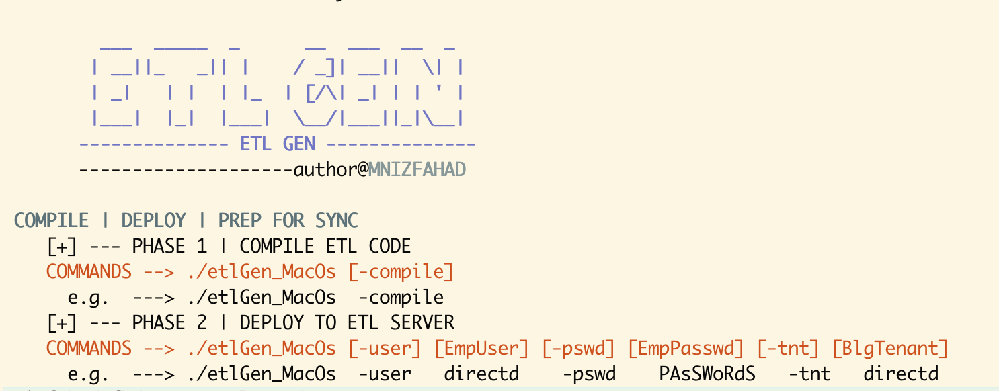

## Operating System

EtlGen is Cross-Platform Program. Chose the correct operating system (e.g. LinxOs) prefix in order to run the program successfully.

```
if you are using Windows
	use = ./etlGen_WinOs
if you are using Linux
	use = ./etlGen_LinxOs
if you are using MacOs
	use = ./etlGen_MacOs

```

Then update permission with

UPDATE **XXX** WITH OS PREFIX(LinxOs, WinOs, MacOs), example :  ./etlGen_MacOs

```
chmod +x ./etlGen_XXXOs
```
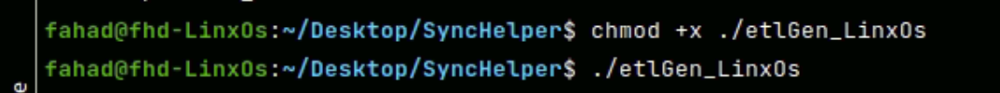
## How to Run (Check Usage with -help , --help, -h)

By executing this command ./etlGenLinxOs we can see the usage or ./etlGenLinxOs —help

```
./etlGenLinxOs
```

```
./etlGenLinxOs -help
```
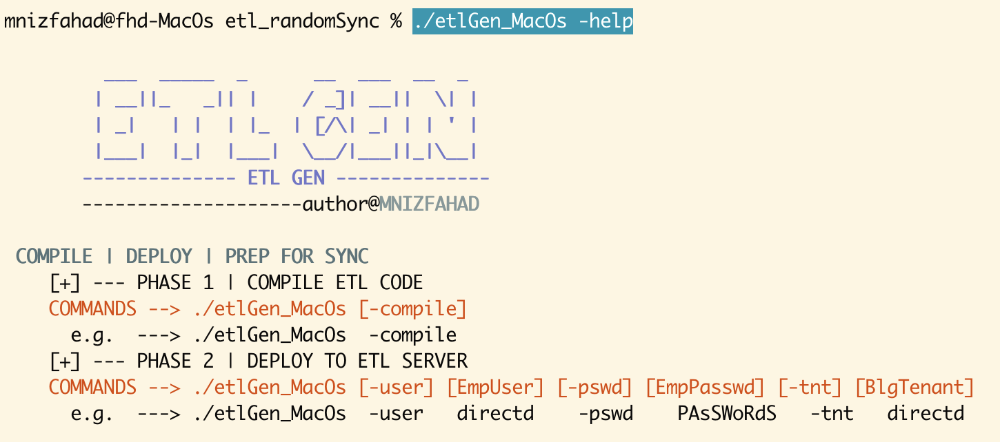
```
./etlGenLinxOs --help
```

```
./etlGenLinxOs -h
```
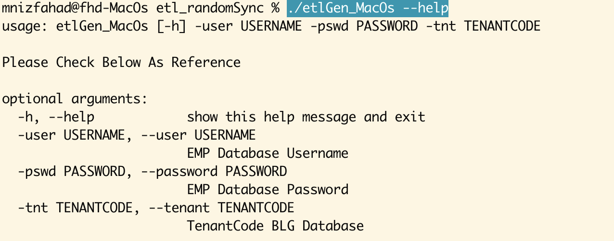
# Phase 1 | Compile ETL Processor

## To Compile ETL | Run with --compile

```
./etlGen_LinxOs -compile
```
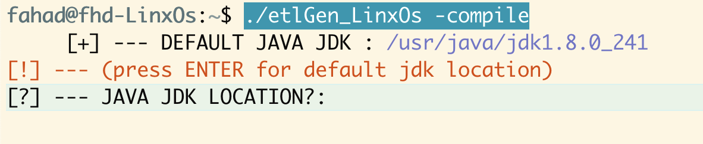
## JAVA JDK location

for Linux java located at /usr/java/jdk1.X.X_XXX .

java location Linux
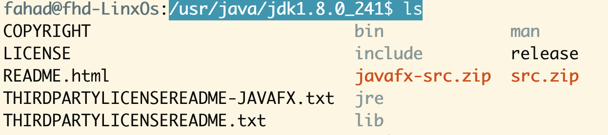
if your JDK location same as above and you are using **java jdk1.8.0_241** you can **press** enter **for default**
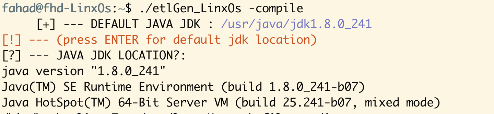
otherwise key in the **JDK location**. for example M**acOs java** located at /Library/Java/JavaVirtualMachines/jdk1.8.0_251.jdk/Contents/Home
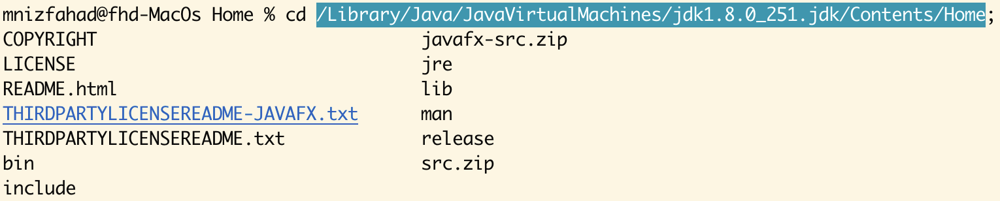
Therefore, have to **key in** as follows
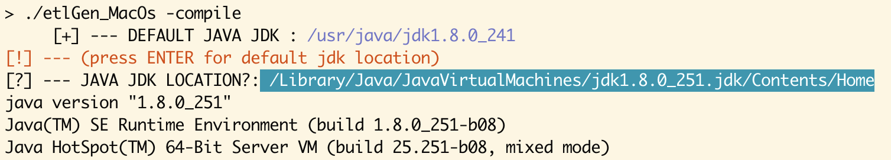
## Gradle Build

if the **selected JDK** correct, the **Etlgen** program will proceed with **Gradle build**
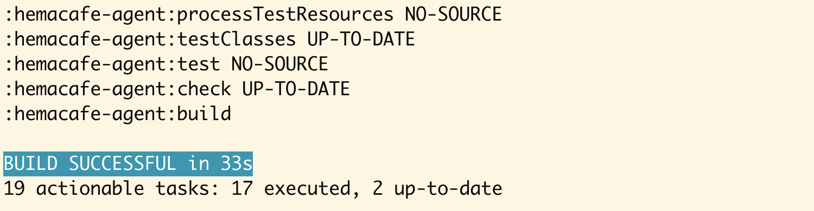
## Demo

# Phase 2 | Deploy Compiled jar to ETL SERVER

This is the section where the file will be sent to the ETL server and process the jar for sync and create a shell script for sync.

in order to complete this step without any exception, Please find below a few points to consider before proceeding with this

- Perform **Phase 1** before execute **Phase 2**
- Correct Access Right in ETL Server (if not contact MIS)
- In order to deploy for a different user (client/customer user), the public key(your) must have access to that particular user account
- If PROCESSOR FOLDER NAME nothing provided as input it will set the folder name UntitleProcessor
- Use unique name when asked PROCESSOR FOLDER NAME otherwise it will be replaced if matched,

## Run with -user , -pswd & -tnt

To Deploy compiled file we will run the following

`./etlGen_LinxOs -user {EMP_DATABASE_USER} -pswd {EMP_DATABASE_PASSWD} -tnt {BLG_TENANT}`
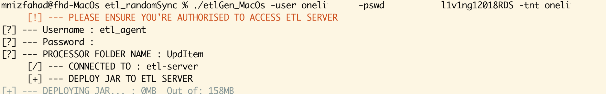
sit back and watch until it's done…..

## Deploying Process
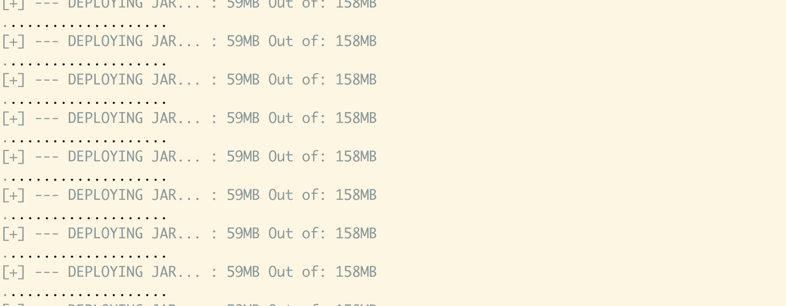
After the **Transfer completed** you will be **prompted** with the DONE TRANSFER
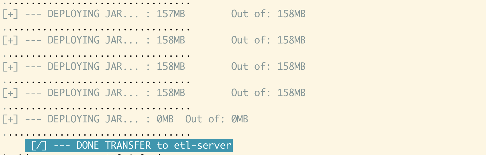
## Process and Prep for Sync

Right after transfer completed the program will proceed with the required process to **prepare the files** for sync
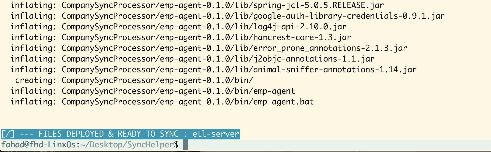
## Demo

# Inspection

after login ETL Server you will find the deployed file under the username(the user that you logged into during the etlgen program execution) directory prep_etlgen
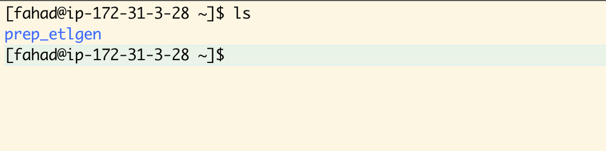
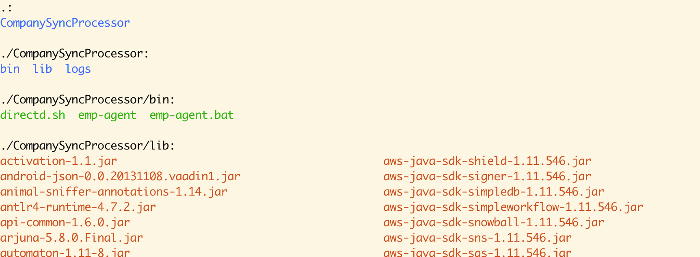
To start sync we can proceed to run the bash file which is created by the Etlgen program.

update SETUP_TRIGGERS
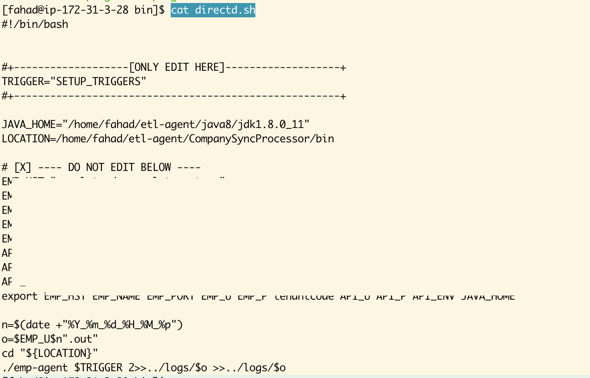
NOTICE :

- In order to deploy for a different user (client/customer user), the public key(your) must have access to that particular user account

## RUN SCRIPT FOR START SYNC

Now you can run the bash file with nohup and & for detached background jobs

```
nohup ./xxx.sh &
```
